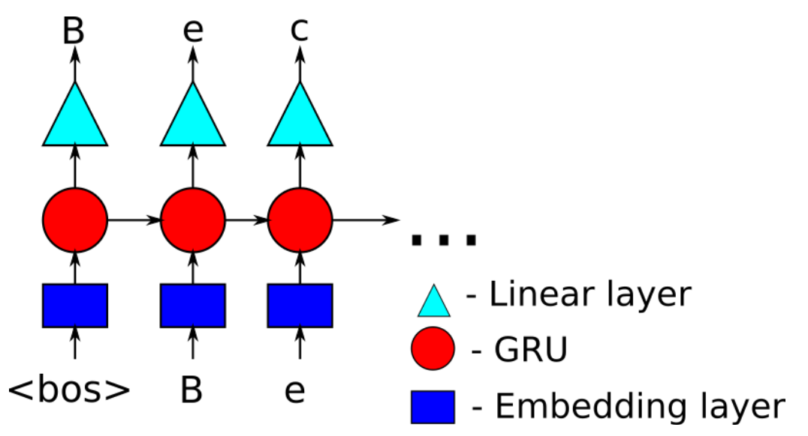

# RNN Name Generator with GRU

Welcome to the RNN Name Generator repository. This project features a Recurrent Neural Network (RNN) that uses Gated Recurrent Units (GRUs) to generate novel names. This model can be trained on datasets of names from various categories such as different languages, fantasy characters, or any other types of names to learn patterns and generate similar names.

## Overview

The RNN name generator with GRU is designed to learn the sequence and structure of characters in names and to predict new name sequences based on that learning. By utilizing GRUs, the model can effectively capture dependencies for different lengths of sequences, making it well-suited for the complexity of name patterns.

### Features

- **GRU-Based RNN Architecture**: Leverages the power of GRUs to manage sequence learning and generation tasks.
- **Flexible Dataset Compatibility**: Can be trained on a wide range of datasets consisting of names from any category or language.
- **Customizable Model Parameters**: Allows for adjustments in the number of layers, hidden unit sizes, and training epochs to experiment with model complexity and performance.
- **Name Generation**: Capable of generating unique names based on learned patterns from the training dataset.

